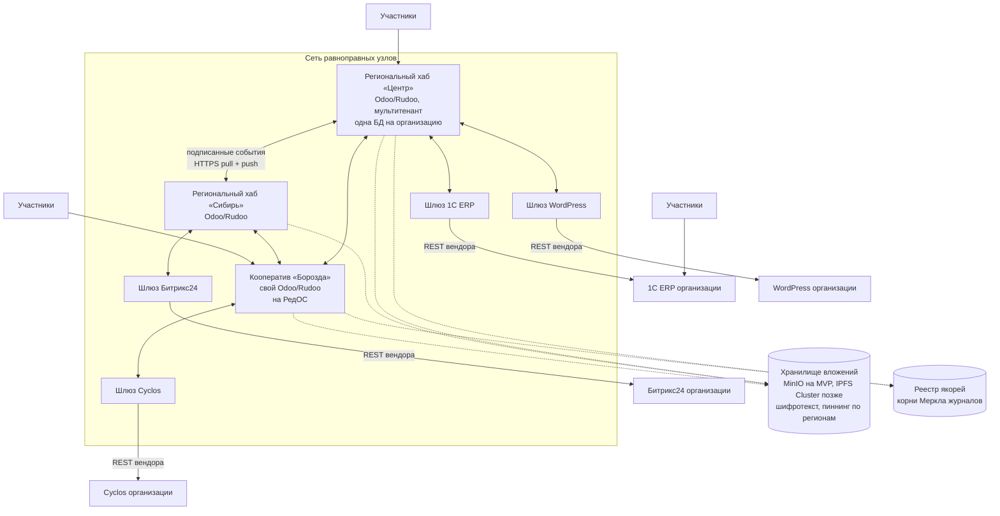

# Федеративная архитектура ДАО КООПЕХ: разбор стека и целевое решение

Статус: черновик v1 от 2026-09-01. Основание — схема владельца продукта, `docs/odoo-map.md`, изучение дистрибутива Rudoo.

## Что нарисовано на схеме

Два уровня:

1. **Децентрализованный облачный сервис (DApp)** — «Odoo + Cyclos, IPFS / OrbitDB». К нему подключены люди и организации.
2. **Коробочные решения** — организация держит свой бэк-офис и федерируется с сетью: 1С-Битрикс (стрелки SQL и API), Odoo (API, IPFS), 1С ERP (API, PostgreSQL), Cyclos (API, OrbitDB), WordPress (API, NoSQL), Битрикс24 (API). У каждой организации свои участники.

Замысел верный: **сеть равноправных узлов вместо одного сервера, участник не заперт в нашей установке**. Ниже — что из перечисленного стека выдерживает нагрузку смыслом, а что нет.

## Приговор по стеку

| Компонент | Решение | Коротко |
|---|---|---|
| Odoo (сборка Rudoo 19.0) | **берём** | Ядро узла. PostgreSQL — единственный источник истины внутри узла. |
| IPFS | **не на MVP** | Задачу «хранить вложения по хэшу» закрывает MinIO с тем же интерфейсом и без демона, кластера и ручного сборщика мусора. IPFS Cluster — на этапе региональных хабов, вторым бэкендом к тому же интерфейсу. |
| Cyclos | **не вторым ядром** | Правило: один авторитетный реестр **на счёт**. Внутренние взаиморасчёты — Odoo; счета организации, живущей на Cyclos, авторитетны в Cyclos и импортируются выпиской. |
| OrbitDB | **убираем** | Подробно ниже. Заменяется подписанным журналом событий. |
| Стрелки SQL / PostgreSQL / NoSQL в чужие БД | **убираем** | Прямой доступ к чужой базе — самая дорогая ошибка на схеме. |
| did:web + верифицируемые удостоверения | **добавляем** | Идентичность без центрального реестра и без блокчейна. |
| Подписанный журнал событий | **добавляем** | То, чем на самом деле является «децентрализованность» в этой задаче. |

## Почему OrbitDB не подходит

OrbitDB — база поверх IPFS с разрешением конфликтов через CRDT. Отказ не по вкусовым причинам, а по четырём конкретным, в порядке убывания силы:

1. **Модель доступа не выражает выборочное раскрытие.** Кто реплицирует базу — получает весь лог; приватность достигается только шифрованием лога целиком. «Этому кооперативу — только сделки со мной, тому — только публичный каталог» в этой модели не формулируется вовсе. Для 152-ФЗ на этом разговор заканчивается, и это главный аргумент.
2. **CRDT не держит инварианты.** Не «нет ACID» вообще, а конкретно: два узла независимо резервируют один экскаватор — слияние даёт двойную бронь; независимо списывают остаток — слияние даёт отрицательный. Сходится к какому-то состоянию, а не к правильному. Паевой взнос, движение по складу и проводка обязаны быть одним неделимым действием.
3. **Реплика требует, чтобы пиры были в сети.** Кооператив в селе с плохим каналом — не исключение, а типичный участник. Данные должны быть доступны, когда его узел спит.
4. **Операционная зрелость и найм.** Переход с js-ipfs на Helia сломал API, промышленных внедрений с учётом нет, разработчиков OrbitDB в стране единицы, разработчиков PostgreSQL — тысячи. Для системы, которой жить десять лет, это решающее.

Отказ не означает отказа от замысла: подписанный журнал с хэш-цепочкой — это тот же eventlog, только без libp2p и с нормальным контролем доступа. Там, где CRDT действительно уместны — совместное редактирование устава или протокола собрания, — берём Yjs. Но никогда для количеств и денег.

Что вместо. У каждого узла — **подписанный журнал только на дописывание**: события связаны хэшами (`prev`), подписаны Ed25519, нумерованы. Это даёт неизменяемость истории и проверяемость без всякого консенсуса, а реплицируется обычным `GET`. Формат — `federation/spec/event.schema.json`, работающий эталон с тестами — `federation/ref/`.

## Почему Cyclos не ставим вторым ядром

Cyclos — зрелая платформа дополнительных валют: счета, переводы, лимиты взаимного кредита, клиринг. Возражение не к качеству, а к месту на схеме.

Два реестра сами по себе не беда: банк и бухгалтерия кооператива — тоже два реестра, и это работает десятилетиями. Беда — **два реестра, имеющих право списывать один и тот же остаток**. Тогда пай начислен в Odoo, обязательство погашено в Cyclos, сальдо разошлись, и никто не знает, какая цифра правильная.

Отсюда точная формулировка правила: **у каждого счёта ровно один авторитетный реестр.** Внутренние взаиморасчёты ДАО КООПЕХ авторитетны в Odoo. Счета организации, живущей на Cyclos, авторитетны в Cyclos, а Odoo видит их как расчётный счёт и импортирует движения выпиской — ровно тот же приём, что уже есть в Rudoo (`account_bank_statement_1c_import`).

Что взять у Cyclos как требование, а не как код: лимиты взаимного кредита на счёт — предел, срок, правило пересмотра. Такого поля в Odoo нет, а взаимный кредит без него не существует.

Решение: **взаимный кредит и клиринг живут в Odoo** как `coop.clearing.*` (см. `docs/odoo-map.md`, раздел 6). Cyclos остаётся в архитектуре ровно там, где он на схеме и нарисован — **как один из коробочных бэк-офисов**: организация, уже работающая на Cyclos, подключается к сети адаптером и остаётся при своей системе.

## Почему нельзя ходить в чужую базу напрямую

На схеме от коробочных решений идут стрелки «SQL», «PostgreSQL», «NoSQL». Это самая дорогая ошибка из всех.

Прямой доступ к базе 1С или Битрикса означает: мы завязались на их внутреннюю схему, которую вендор меняет в любом обновлении, не предупреждая; мы обходим их бизнес-логику и проверки; мы обязаны знать пароль от чужой боевой базы. Первое же обновление 1С кладёт интеграцию, и виноваты будем мы.

**Только адаптеры поверх публичных API вендоров.** Адаптер — маленькая служба без состояния: с одной стороны наш протокол, с другой REST вендора. Пишется и обновляется независимо от узла, ломается изолированно.

## Целевая архитектура

Ключевое отличие от схемы владельца: **центрального «DApp» нет**. Региональный хаб — такой же узел, как кооператив со своим сервером, и не имеет никаких особых прав. Хаб нужен затем, что большинству кооперативов не нужен свой сервер, а не затем, что он главный. Как только хаб получает привилегию, децентрализация превращается в лозунг.

### Слои узла

| Слой | Чем является | Гарантии |
|---|---|---|
| Хранилище | PostgreSQL узла | ACID, транзакции, `ir.rule` на уровне записи |
| Прикладной | Odoo/Rudoo + наши модули `coop.*` | бизнес-логика, права, интерфейс |
| Журнал | подписанные события, хэш-цепочка | неизменяемость истории, проверяемость |
| Транспорт | HTTPS pull (обязательно), затем SSE, затем NATS JetStream | доставка |
| Вложения | MinIO узла, позже IPFS Cluster | адресация по содержимому |
| Якорение | корни Меркла в реестр | доказательство, что история не переписана |

## Согласованность: что где допустимо

| Данные | Модель | Почему |
|---|---|---|
| Остатки, проводки, паевые счета | ACID внутри узла | Деньги не бывают «примерно». |
| Каталог чужих предложений | согласованность в конечном счёте | Устаревшее предложение стоит лишнего звонка, а не денег. |
| Состояние сделки | две подписи | Ни одна сторона не объявляет состояние за обоих. |
| Обязательства между организациями | две подписи | Одностороннее «ты мне должен» силы не имеет. |
| Клиринг круга участников | подписи всех участников круга | Взаимозачёт исполняется, только когда с результатом согласны все. |
| Репутация, отзывы | в конечном счёте, с задержкой раскрытия | Отзыв публикуется сначала хэшем, потом текстом, — чтобы не подстраивались. |

## Географическое масштабирование

**Узлы у пользователей.** Кооператив ставит узел там, где работает. Rudoo совместим с АльтерОС, РедОС, ОСнова и РОСа — размещение в РФ и на отечественных ОС не требует отдельной работы.

**Региональные хабы** — мультитенантная Odoo: одна база на организацию, общая инфраструктура. Это штатная модель Odoo, а не наша выдумка. Хаб добавляется в новом регионе копированием конфигурации; связь с остальными — тот же протокол, что у всех.

**Поиск по общему каталогу.** Каждый хаб строит свой индекс по событиям `catalog.offer.*` тех узлов, на которые подписан. На старте — полнотекстовый поиск PostgreSQL, он держит миллионы записей и не требует лишней инфраструктуры. OpenSearch — когда упрёмся в ранжирование и фасеты, а не заранее.

**Вложения.** На MVP — MinIO на узле, раздача соседям через `GET /federation/attachment/{ct_hash}`. IPFS Cluster появляется вместе со вторым хабом, вторым бэкендом к тому же интерфейсу хранилища. Фактор репликации три, а не «везде»: узел-владелец, хаб его региона и хаб региона контрагента при первой сделке. Холодные вложения старше года — владелец плюс один архив, иначе хранилище каждого хаба растёт линейно от трафика всей сети.

**Задержка.** Опрос журнала раз в минуту достаточен для каталога. Для сделок и сообщений — push в `/federation/inbox` сразу после события. Очередь (NATS JetStream) появляется, когда узлов станет столько, что опрос всех начнёт заметно греть сеть; протокол от этого не меняется.

## Идентичность

**Организации — `did:web`.** Идентификатор узла `did:web:coop-borozda.ru`, документ с ключами на `https://coop-borozda.ru/.well-known/did.json`. Разрешается обычным HTTPS: ни блокчейна, ни центрального реестра, ни платы за регистрацию. У организации есть домен и юрлицо, смена домена — событие, оформляемое решением правления.

**Люди — `did:key`.** Здесь `did:web` был бы ошибкой: он привязан к домену, а человек доменом кооператива не владеет. Ушёл из кооператива А на узел кооператива Б — и идентичность потеряна вместе со всеми полученными удостоверениями. У `did:key` ключ и есть идентичность: резолвить нечего, терять нечего. Это и есть портируемость, ради которой всё затевается.

Обратная сторона честная: потерянный ключ не восстанавливается. Требовать полного самостоятельного хранения от пайщицы-пенсионерки нельзя — по умолчанию ключ хранится на узле, с опцией забрать его себе и с восстановлением через подписи членов правления.

**Ротация ключей** — добавлением нового ключа при сохранении старого с отметкой `revoked`: события трёхлетней давности обязаны проверяться и после смены ключа.

**Членство и доверие** — верифицируемые удостоверения, подписанные кооперативом: «такой-то состоит пайщиком с такого-то года». Участник предъявляет их на другом узле, не заставляя тот ходить с расспросами. Формат — плоский JWS в профиле JOSE, не JSON-LD: канонизация RDFC-1.0 гарантированно разойдётся между Python, PHP и 1С, а JWS с Ed25519 средний интегратор делает за день. Отзыв — публикуемым битовым массивом, а не онлайновым сервисом статусов: сервис означал бы и ре-централизацию, и утечку — эмитент видел бы каждую проверку.

**Две подписи разного назначения, не смешивать.** Техническая (Ed25519, целостность журнала, машинная проверка) и юридическая (КЭП, ГОСТ Р 34.10-2012, для актов и договоров в ФНС). Одна не заменяет другую. Поле `alg` заложено сразу — чтобы добавление ГОСТ-подписи не потребовало смены формата.

**Вход человека** остаётся обычным: логин на своём узле. did:web — идентичность организаций и служб, а не замена паролю для кооператора.

## Персональные данные

Широковещательное событие не содержит персональных данных — никогда. Всё личное идёт адресно (`to`) и только тем, кому предназначено.

Вложения с персональными данными и коммерческой тайной хранятся **только зашифрованными**: в хранилище лежит шифротекст, ключ файла остаётся у узла-владельца и заворачивается отдельно под каждого получателя.

Отсюда единственный работающий ответ на требование об удалении: **удаление — это уничтожение ключа**. Из контент-адресуемого хранилища данные не изымаются — распиновать можно, гарантировать удаление у всех, кто скачал, нельзя. Поэтому «удалить» означает «уничтожить ключ», и событие об уничтожении ключа и есть доказательство исполнения.

Разделяем два бакета: публичные картинки каталога хранятся открыто и кешируются, всё остальное — только шифротекст. Шифровать фотографию мешка муки — удвоение нагрузки без пользы.

## Адаптеры к чужим системам

Минимальный контракт узла — пять точек HTTPS, из них обязательны две: `GET /.well-known/did.json` и `GET /federation/log`. Всё остальное — ускорения.

Это ограничение сознательное. Если для участия понадобится libp2p, IPFS и очередь сообщений, интеграторы 1С и WordPress не придут, и сеть останется из одних наших установок. Порог входа — день работы среднего интегратора: подписать JSON и отдать его по HTTP.

| Система | Что делает адаптер |
|---|---|
| 1С ERP | Забирает номенклатуру и документы через HTTP-сервисы 1С, публикует предложения и акты в журнал. |
| 1С-Битрикс, Битрикс24 | REST вендора; каталог и сделки. |
| Cyclos | REST Cyclos; счета и обязательства участников. |
| WordPress | REST API; витрина организации как источник предложений. |

## Этапы

| Этап | Что получаем | Оценка |
|---|---|---|
| 0 | Спецификация и справочная реализация — **сделано**, `federation/` | — |
| 1 | Узел на Odoo/Rudoo: журнал, подпись, did:web, `GET /log` | 3–4 недели |
| 2 | Приём чужих журналов, индекс каталога, поиск по сети | 3 недели |
| 3 | Двусторонние сделки между узлами, состояние по двум подписям | 4 недели |
| 4 | Обязательства и клиринг круга участников | 4 недели |
| 5 | Вложения: MinIO, шифрование с конвертами ключей, якорение | 2 недели |
| 6 | Первый адаптер (1С ERP) как проверка порога входа | 3 недели |
| 7 | Второй региональный хаб — проверка географического масштабирования | 2 недели |

## Что закладывается сразу, иначе переписывать

Семь вещей, каждая из которых дописывается потом втрое дороже.

**Transactional outbox.** «PostgreSQL — источник истины» само по себе недостаточно: событие журнала пишется в ту же транзакцию, что и изменение бизнес-данных, иначе классический dual-write — событие ушло, транзакция откатилась. Отправкой занимается отдельный процесс-шлюз рядом с Odoo, читающий outbox по курсору. Odoo никогда не ходит в сеть внутри пользовательской транзакции. Побочная выгода: шлюз мигрируется отдельно от Odoo при апгрейде.

**Вымарывание тела.** Уже сделано в спецификации и эталоне: конверт подписывает хэш тела, а не тело. Без этого адресные события ломают проверяемость цепочки — либо утекают данные, либо теряется полнота журнала.

**Статус «сомнительно».** Компрометация ключа задним числом не должна стирать события: они помечаются и требуют переподтверждения. Добавить это поле потом — значит переразобрать весь журнал.

**Доверие не реплицируется, а вычисляется.** У агрегата «доверие к Б» нет авторитетного узла: сам Б плохие отзывы публиковать не станет. Каждый узел считает его сам из полученных подписанных отзывов. Следствие, которое надо принять до того, как его увидят в интерфейсе: **у разных узлов будут разные числа**, потому что у них разный набор входных событий. Формула обязана быть монотонной и устойчивой к неполноте данных — иначе узел, получивший 90% событий, покажет дико другое значение.

**Клиринг — это раунд со сбором подписей, а не автозачёт.** Круговой зачёт в РФ оформляется многосторонним соглашением (ст. 410 и 421 ГК), односторонний зачёт возможен только между двумя лицами. Значит модель — `coop.clearing.round` со статусами «предложен → подписан → проведён», применение только при полном комплекте подписей, отмена целиком при неполном. Плюс сам поиск циклов в графе долгов — отдельная работа на две-три недели, а не поле в модели.

**Версионирование экономических правил.** `coop.rule` с версией и датой вступления в силу. Без этого первая же смена устава лишит возможности пересчитать прошлый год.

**Снимки для догона.** Журнал не хранится вечно: ретенция полного журнала от 400 дней, дальше запрос с устаревшей позиции получает ответ со ссылкой на подписанный снимок состояния. Тот же приём, что базовая копия плюс WAL в PostgreSQL.

## Мультитенантность хаба: две разные вещи

Формулировка «мультитенантная Odoo, одна БД на организацию» смешивает два взаимоисключающих режима.

Odoo multi-company в одной базе дёшев по ресурсам, но изоляция там держится на `ir.rule` — одна ошибка означает утечку между кооперативами, апгрейд общий для всех, отдать организации дамп её данных нельзя. Для независимых юрлиц не годится.

Одна база на организацию — правильный выбор: настоящая изоляция, `pg_dump` и есть «уйти с узла со своими данными», то есть та самая портируемость. Цена — плотность: Odoo держит кеш реестра порядка 200–400 МБ на активную базу, и на сервере в 32 ГБ реалистично 40–80 малоактивных баз, а не пятьсот. От этого числа и считается экономика хаба.

Практический компромисс: малые кооперативы до пяти пользователей — в общую базу хаба тарифом «эконом», крупные — отдельной базой. **Переход из общей базы в отдельную должен быть предусмотрен с первого дня**, иначе он физически невозможен.

## Риски

**Ключи.** Потеря ключа узла — потеря возможности продолжать журнал. В DID-документе с самого начала два ключа: рабочий и резервный офлайновый; процедура ротации отрепетирована до продакшна, а не придумана после первой потери. Ключ узла не в базе и не в репозитории.

**Тихая рассинхронизация.** Худший класс ошибок: обнаруживается через полгода при сверке. Поэтому ежедневное автоматическое сличение контрольных сумм по общим объектам и отчёт о расхождениях с соседями — часть первого этапа, а не последнего.

**Апгрейды Odoo ломают свой код.** У нас больше десятка своих моделей, мажорная версия выходит ежегодно, миграция Community — своими силами, и график задаёт не Odoo, а Rudoo. Отсюда правило: федерация живёт отдельным слабосвязанным модулем, чтобы мигрировать её независимо от бизнес-логики, а наследование от `account.*` сводится к минимуму.

**Расхождение журналов сторон.** Если сторона утверждает, что подписала акт, а в её журнале события нет, это спор для людей и арбитража, а не задача для алгоритма. Автоматическое разрешение здесь было бы вредным: оно скрыло бы недобросовестность.

**Порог входа для интеграторов.** Главный риск сети — что к ней никто не подключится. Меряется одним числом: сколько времени у стороннего разработчика уходит на первый работающий узел. Если больше дня — упрощаем протокол, а не пишем документацию.

**Соблазн централизации.** Как только хаб получает право что-то решать за узлы, сеть становится обычным SaaS с распределённым фасадом. Проверка простая: всё, что умеет хаб, обязан уметь кооператив на своём сервере.

## Связанные документы

- `federation/README.md` — правила протокола, `federation/spec/` — схемы и HTTP-контракт, `federation/ref/` — работающий эталон с тестами.
- `docs/odoo-map.md` — карта сущностей прототипа на модели Odoo и модули Rudoo.
- Vault: `Проект/Посадка MVP на Odoo.md`.
