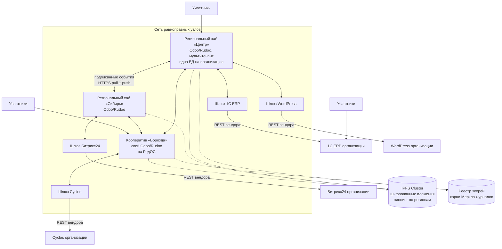

# Федеративная архитектура ДАО КООПЕХ: разбор стека и целевое решение

Статус: черновик v1 от 2026-09-01. Основание — схема владельца продукта, `docs/odoo-map.md`, изучение дистрибутива Rudoo.

## Что нарисовано на схеме

Два уровня:

1. **Децентрализованный облачный сервис (DApp)** — «Odoo + Cyclos, IPFS / OrbitDB». К нему подключены люди и организации.
2. **Коробочные решения** — организация держит свой бэк-офис и федерируется с сетью: 1С-Битрикс (стрелки SQL и API), Odoo (API, IPFS), 1С ERP (API, PostgreSQL), Cyclos (API, OrbitDB), WordPress (API, NoSQL), Битрикс24 (API). У каждой организации свои участники.

Замысел верный: **сеть равноправных узлов вместо одного сервера, участник не заперт в нашей установке**. Ниже — что из перечисленного стека выдерживает нагрузку смыслом, а что нет.

## Приговор по стеку

| Компонент | Решение | Коротко |
|---|---|---|
| Odoo (сборка Rudoo 19.0) | **берём** | Ядро узла. PostgreSQL — единственный источник истины внутри узла. |
| IPFS | **берём с ограничением** | Только вложения, только шифрованные, пиннинг через IPFS Cluster. Источником истины не делаем. |
| Cyclos | **не вторым ядром** | Два реестра денег рядом — вечная сверка. Поддерживаем адаптером для тех, кто уже на нём. |
| OrbitDB | **убираем** | Подробно ниже. Заменяется подписанным журналом событий. |
| Стрелки SQL / PostgreSQL / NoSQL в чужие БД | **убираем** | Прямой доступ к чужой базе — самая дорогая ошибка на схеме. |
| did:web + верифицируемые удостоверения | **добавляем** | Идентичность без центрального реестра и без блокчейна. |
| Подписанный журнал событий | **добавляем** | То, чем на самом деле является «децентрализованность» в этой задаче. |

## Почему OrbitDB не подходит

OrbitDB — база поверх IPFS с разрешением конфликтов через CRDT. Отказ не по вкусовым причинам, а по четырём конкретным:

1. **Нет транзакций.** Паевой взнос, движение по складу и проводка обязаны быть одним неделимым действием. CRDT сходятся «когда-нибудь» и не умеют откатывать связанную группу изменений. Для бухгалтерии это дисквалификация.
2. **Нет серверных запросов.** «Показать ресурсы категории «Стройматериалы» в радиусе 200 км, у которых есть свободный остаток» — в OrbitDB это выкачать всё к себе и отфильтровать. На сотне организаций работает, на десяти тысячах — нет.
3. **Реплика требует, чтобы пиры были в сети.** Кооператив в селе с плохим каналом — не исключение, а типичный участник. Данные должны быть доступны, когда его узел спит.
4. **Модель доступа сводится к списку ключей на запись.** У нас нужны правила уровня записи: пайщик видит одно, правление другое, ревизионная комиссия третье, а персональные данные не видит никто, кроме владельца. Это `ir.rule` в Odoo, и в CRDT-базе такого нет.

Главное же: **CRDT решают задачу, которой у нас нет.** Разрешение конфликтов нужно, когда несколько сторон правят одну запись. У нас у каждого факта один хозяин, а двусторонние объекты требуют двух подписей. Конфликт слияния возникнуть просто не из чего.

Что вместо. У каждого узла — **подписанный журнал только на дописывание**: события связаны хэшами (`prev`), подписаны Ed25519, нумерованы. Это даёт неизменяемость истории и проверяемость без всякого консенсуса, а реплицируется обычным `GET`. Формат — `federation/spec/event.schema.json`, работающий эталон с тестами — `federation/ref/`.

## Почему Cyclos не ставим вторым ядром

Cyclos — зрелая платформа дополнительных валют: счета, переводы, лимиты взаимного кредита, клиринг. Возражение не к качеству, а к месту на схеме.

Поставить Cyclos рядом с Odoo — значит завести **два реестра денег и два реестра участников**. Дальше начинается сверка: пай начислен в Odoo, обязательство погашено в Cyclos, сальдо разошлись, и никто не знает, какая цифра правильная. Кооператив, который не может назвать свой баланс одним числом, теряет доверие быстрее, чем от любой технической аварии.

Решение: **взаимный кредит и клиринг живут в Odoo** как `coop.clearing.*` (см. `docs/odoo-map.md`, раздел 6). Cyclos остаётся в архитектуре ровно там, где он на схеме и нарисован — **как один из коробочных бэк-офисов**: организация, уже работающая на Cyclos, подключается к сети адаптером и остаётся при своей системе.

## Почему нельзя ходить в чужую базу напрямую

На схеме от коробочных решений идут стрелки «SQL», «PostgreSQL», «NoSQL». Это самая дорогая ошибка из всех.

Прямой доступ к базе 1С или Битрикса означает: мы завязались на их внутреннюю схему, которую вендор меняет в любом обновлении, не предупреждая; мы обходим их бизнес-логику и проверки; мы обязаны знать пароль от чужой боевой базы. Первое же обновление 1С кладёт интеграцию, и виноваты будем мы.

**Только адаптеры поверх публичных API вендоров.** Адаптер — маленькая служба без состояния: с одной стороны наш протокол, с другой REST вендора. Пишется и обновляется независимо от узла, ломается изолированно.

## Целевая архитектура

Ключевое отличие от схемы владельца: **центрального «DApp» нет**. Региональный хаб — такой же узел, как кооператив со своим сервером, и не имеет никаких особых прав. Хаб нужен затем, что большинству кооперативов не нужен свой сервер, а не затем, что он главный. Как только хаб получает привилегию, децентрализация превращается в лозунг.

### Слои узла

| Слой | Чем является | Гарантии |
|---|---|---|
| Хранилище | PostgreSQL узла | ACID, транзакции, `ir.rule` на уровне записи |
| Прикладной | Odoo/Rudoo + наши модули `coop.*` | бизнес-логика, права, интерфейс |
| Журнал | подписанные события, хэш-цепочка | неизменяемость истории, проверяемость |
| Транспорт | HTTPS pull (обязательно), push / NATS / libp2p (по желанию) | доставка |
| Вложения | IPFS Cluster или HTTPS узла | адресация по содержимому |
| Якорение | корни Меркла в реестр | доказательство, что история не переписана |

## Согласованность: что где допустимо

| Данные | Модель | Почему |
|---|---|---|
| Остатки, проводки, паевые счета | ACID внутри узла | Деньги не бывают «примерно». |
| Каталог чужих предложений | согласованность в конечном счёте | Устаревшее предложение стоит лишнего звонка, а не денег. |
| Состояние сделки | две подписи | Ни одна сторона не объявляет состояние за обоих. |
| Обязательства между организациями | две подписи | Одностороннее «ты мне должен» силы не имеет. |
| Клиринг круга участников | подписи всех участников круга | Взаимозачёт исполняется, только когда с результатом согласны все. |
| Репутация, отзывы | в конечном счёте, с задержкой раскрытия | Отзыв публикуется сначала хэшем, потом текстом, — чтобы не подстраивались. |

## Географическое масштабирование

**Узлы у пользователей.** Кооператив ставит узел там, где работает. Rudoo совместим с АльтерОС, РедОС, ОСнова и РОСа — размещение в РФ и на отечественных ОС не требует отдельной работы.

**Региональные хабы** — мультитенантная Odoo: одна база на организацию, общая инфраструктура. Это штатная модель Odoo, а не наша выдумка. Хаб добавляется в новом регионе копированием конфигурации; связь с остальными — тот же протокол, что у всех.

**Поиск по общему каталогу.** Каждый хаб строит свой индекс по событиям `catalog.offer.*` тех узлов, на которые подписан. На старте — полнотекстовый поиск PostgreSQL, он держит миллионы записей и не требует лишней инфраструктуры. OpenSearch — когда упрёмся в ранжирование и фасеты, а не заранее.

**Вложения** — IPFS Cluster с пиннингом в каждом регионе, где есть хаб. Узел без IPFS отдаёт вложения по HTTPS: `GET /federation/attachment/{sha256}`.

**Задержка.** Опрос журнала раз в минуту достаточен для каталога. Для сделок и сообщений — push в `/federation/inbox` сразу после события. Очередь (NATS JetStream) появляется, когда узлов станет столько, что опрос всех начнёт заметно греть сеть; протокол от этого не меняется.

## Идентичность

**did:web.** Идентификатор узла — `did:web:coop-borozda.ru`, документ с открытыми ключами лежит на `https://coop-borozda.ru/.well-known/did.json`. Разрешается обычным HTTPS: ни блокчейна, ни центрального реестра, ни платы за регистрацию. Организация, у которой есть домен, уже имеет идентичность.

**Ротация ключей** — добавлением нового ключа при сохранении старого с отметкой `revoked`: события трёхлетней давности обязаны проверяться и после смены ключа.

**Членство и доверие** — верифицируемые удостоверения, подписанные кооперативом: «такой-то состоит пайщиком с такого-то года». Участник предъявляет их на другом узле, не заставляя тот ходить с расспросами.

**Вход человека** остаётся обычным: логин на своём узле. did:web — идентичность организаций и служб, а не замена паролю для кооператора.

## Персональные данные

Широковещательное событие не содержит персональных данных — никогда. Всё личное идёт адресно (`to`) и только тем, кому предназначено.

Вложения с персональными данными и коммерческой тайной выкладываются **только зашифрованными**: в IPFS попадает шифротекст, ключ передаётся адресно. IPFS не забывает — то, что туда попало открытым, оттуда не изымается, и это надо понимать до первой публикации, а не после.

## Адаптеры к чужим системам

Минимальный контракт узла — пять точек HTTPS, из них обязательны две: `GET /.well-known/did.json` и `GET /federation/log`. Всё остальное — ускорения.

Это ограничение сознательное. Если для участия понадобится libp2p, IPFS и очередь сообщений, интеграторы 1С и WordPress не придут, и сеть останется из одних наших установок. Порог входа — день работы среднего интегратора: подписать JSON и отдать его по HTTP.

| Система | Что делает адаптер |
|---|---|
| 1С ERP | Забирает номенклатуру и документы через HTTP-сервисы 1С, публикует предложения и акты в журнал. |
| 1С-Битрикс, Битрикс24 | REST вендора; каталог и сделки. |
| Cyclos | REST Cyclos; счета и обязательства участников. |
| WordPress | REST API; витрина организации как источник предложений. |

## Этапы

| Этап | Что получаем | Оценка |
|---|---|---|
| 0 | Спецификация и справочная реализация — **сделано**, `federation/` | — |
| 1 | Узел на Odoo/Rudoo: журнал, подпись, did:web, `GET /log` | 3–4 недели |
| 2 | Приём чужих журналов, индекс каталога, поиск по сети | 3 недели |
| 3 | Двусторонние сделки между узлами, состояние по двум подписям | 4 недели |
| 4 | Обязательства и клиринг круга участников | 4 недели |
| 5 | Вложения: IPFS Cluster, шифрование, якорение | 2 недели |
| 6 | Первый адаптер (1С ERP) как проверка порога входа | 3 недели |
| 7 | Второй региональный хаб — проверка географического масштабирования | 2 недели |

## Риски

**Ключи.** Потеря ключа узла — потеря возможности продолжать журнал. Нужен регламент хранения и восстановления до запуска, а не после первой потери.

**Расхождение журналов сторон.** Если сторона утверждает, что подписала акт, а в её журнале события нет, это спор для людей и арбитража, а не задача для алгоритма. Автоматическое разрешение здесь было бы вредным: оно скрыло бы недобросовестность.

**Порог входа для интеграторов.** Главный риск сети — что к ней никто не подключится. Меряется одним числом: сколько времени у стороннего разработчика уходит на первый работающий узел. Если больше дня — упрощаем протокол, а не пишем документацию.

**Соблазн централизации.** Как только хаб получает право что-то решать за узлы, сеть становится обычным SaaS с распределённым фасадом. Проверка простая: всё, что умеет хаб, обязан уметь кооператив на своём сервере.

## Связанные документы

- `federation/README.md` — правила протокола, `federation/spec/` — схемы и HTTP-контракт, `federation/ref/` — работающий эталон с тестами.
- `docs/odoo-map.md` — карта сущностей прототипа на модели Odoo и модули Rudoo.
- Vault: `Проект/Посадка MVP на Odoo.md`.
